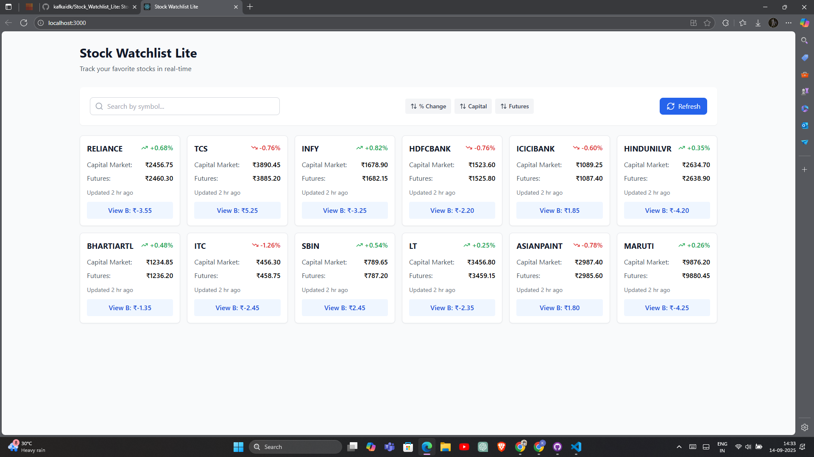

## Stock Watchlist Lite:

A modern React web application for tracking stock prices with real-time updates, search functionality, and detailed stock information.

## Screenshot:

### How to Run the Project:

Prerequisites: 
Node.js (v14 or higher) 
npm or yarn

Installation & Setup: 

Clone the repository: 
git clone  
cd stock-watchlist-lite

Install dependencies: 
npm install

Start the development server: 
npm start

Open your browser and navigate to http://localhost:3000

Running Tests: 
npm test
